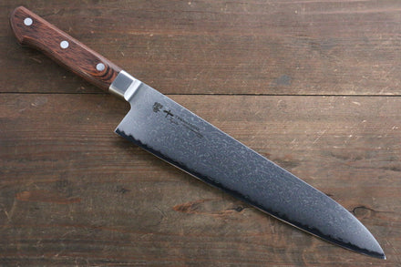
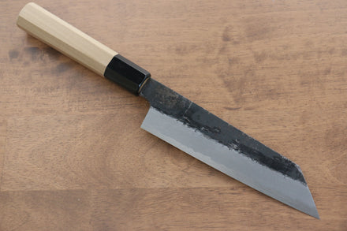
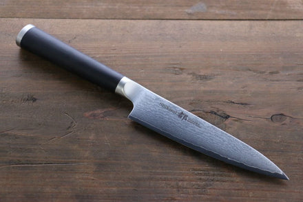
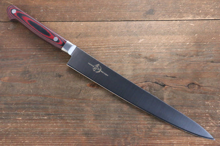
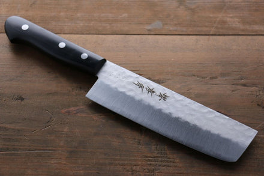
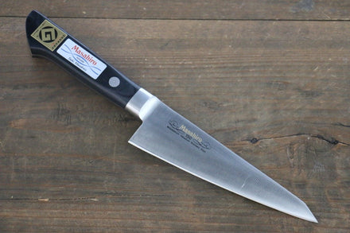

# knife_scrapy
I love kitchen knives, especially Japanese Kitchen Knives. The artisanship of Japanese craftsman is, to me, stunning. Ever since I started cooking seriously, I developed a fascination for kitchen knives.

There are several types of Japanese Kitchen Knives. It may seem subtle at first, but they each possess qualities that make them uniquely suited for specific tasks.
The Gyuto (literally, cow-knife), is an all-purpose knife. You can do 90% of all tasks using the Gyuto

The Santoku (literally, the 3-virtues knife), is also an all-purpose knife, but smaller than the typical Gyuto. You can also do 90% of all tasks using the Gyuto

Althought the Gyuto and Santoku knives are both considered to be "all-purpose" knives, you can see that they have different shapes and lengths. Some prefer one shape over the other; some prefer one length over the other

The Petty (literally, the small knife), is a, well, small all-purpose knife. Typically one would use this knife for slicing fruits or small, delicate vegetables. You can use this knife to handle the rest of the 9 out of 10% of all tasks.

The final 1% of tasks you would ever face when cooking, can actually be fulfilled with the aforementioned all-purpose knives just fine, for the most part. However, certain knives are indeed, more suited than them for specific tasks. For instance,
The sujihiki (literally, muscle drawer), has a long and thin blade. It is most suited for slicing through delicate meats, as the small contact area ensure minimal dragging, which could tear the muscle fibers

The nakiri (literally, vegetable cutter), is razor-sharp but sturdy. It is most suited for chopping open things with shells, such as small pumpkins, watermellons, etc. (please don't use it to open a coconut!)

The hoesuki (literally, bone lover), is nimble with an odd triangular-shape. It is traditionally used as a chicken deboning knife and required immense skills to master (way beyond what I'm capable of, anyway)

From personal experience, most people don't know much about these fun details about kitchen knives. That is why I decided, wouldn't it be fun to start a computer vision project that explores kitchen knives?

This is the first part of a larger project that seeks to train an image classifier for kitchen knives. Similar to how all great men in history had a great woman in their lives, every great machine learning model requires a great dataset.

Here, I have implemented a webcrawler using scrapy to download images from the online knife shop, [ Seisuke Knife ](https://int.seisukeknife.com/). My hope is that, by collecting images from more websites like Seisuke's, I will be able to eventually train an image classifier that can classify images of kitchen knives into the following 11 categories:
- Gyuto (cow-knife)
- Santoku (3-virtues)
- Bunka (culture)
- Petty (small)
- Pairing (tiny)
- Honesuki (bone-lover)
- Nakiri (vegetable cutter)
- Yanagi (willow tree blade)
- Sujihiki (muscle drawer)
- Deba (revealed blade)
- Usuba (thin blade)

If you would like to have a dataset of iamges from Seisuke -- why wouldn't you -- you can also try running my crawler to see what happens.

First, to ensure that you have all the required dependencies, after pulling this repo, run
`pip install -r requirements.txt`

Next, you can simply run,
`scrapy crawl knife_spider`

You will want to change the location to which these images are being downloaded. You can simple edit the path that is contained in the `settings.py` file

After running this program, the spider will create 11 folders with the aforementioned 11 knife names in the directory that you have provided in the settings. 
Then, the spider will automatically sort the knife images downloaded from Seisuke into the aforementioned 11 categories

Happy slicing, cooking, crawling, and machine-learning!

(PS. Not sure if anyone would care to see this, but here is my development diary for this [ project ](https://bow-dogwood-10f.notion.site/Webcrawler-Notes-a0c1c08e39fe4863859d81cde12ba348?pvs=4))